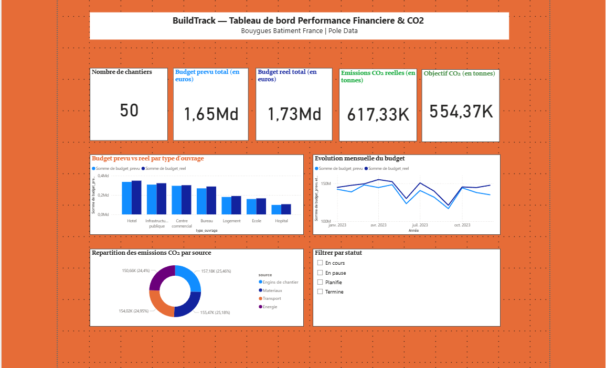

# BuildTrack — Dashboard Performance Financiere et CO2

Projet realise dans le cadre d'une candidature au poste de
Data Analyst en alternance chez Bouygues Batiment France.

## Apercu du dashboard



---

## Contexte

Le Secretariat General de Bouygues Batiment France pilote un pole Data
dedie a l'analyse des donnees financieres et extra-financieres.
BuildTrack simule exactement ce environnement : suivi budgetaire des
chantiers, pilotage des emissions CO2 et tableaux de bord KPIs pour
les unites operationnelles.

---

## Fonctionnalites

| Module | Description |
|---|---|
| Base de donnees SQL | Schema relationnel avec 4 tables et 3 050 lignes de donnees |
| Requetes d'analyse | 5 requetes SQL metier : depassements budget, emissions CO2, evolution mensuelle |
| Dashboard Power BI | Tableau de bord interactif avec KPIs, histogrammes, courbes et filtres |
| Catalogue de donnees | Documentation metier de 13 colonnes en CSV et JSON |

---

## Structure du projet

BuildTrack/
├── data/          → Base SQLite et fichiers Excel exports
├── sql/           → Creation des tables et requetes d'analyse
├── python/        → Generation des donnees et export Power BI
├── powerbi/       → Dashboard .pbix
├── catalog/       → Catalogue de donnees CSV et JSON
└── docs/          → Documentation

---

## Stack technique

- Python — Pandas, SQLAlchemy, Faker
- SQL — SQLite, requetes d'analyse metier
- Power BI — Dashboard KPIs interactif
- Git / GitHub — Versioning

---

## Lancer le projet

### 1. Cloner le repo
```bash
git clone https://github.com/LegreArnold/BuildTrack.git
cd BuildTrack
```

### 2. Creer l'environnement virtuel
```bash
python -m venv venv
venv\Scripts\activate
pip install -r requirements.txt
```

### 3. Lancer les modules
```bash
# Creer la base de donnees
python sql/create_tables.py

# Generer les donnees
python python/generate_data.py

# Lancer les requetes d'analyse
python sql/requetes_analyse.py

# Exporter pour Power BI
python python/export_powerbi.py

# Generer le catalogue
python catalog/catalogue.py
```

### 4. Ouvrir le dashboard
Ouvrir le fichier `powerbi/dashboard_buildtrack.pbix` avec Power BI Desktop.

---

## Resultats

- 50 chantiers simules sur 7 types d'ouvrages
- 600 lignes de donnees financieres mensuelles
- 2 400 lignes d'emissions CO2 par source
- 1,65 Md euros de budget prevu analyse
- 617 000 tonnes de CO2 suivies vs objectif

---

## Competences developpees

- Modelisation d'une base de donnees relationnelle (SQL)
- Analyse de donnees financieres et extra-financieres
- Conception de KPIs et tableaux de bord Power BI
- Documentation metier via un catalogue de donnees
- Versioning professionnel avec Git

---
